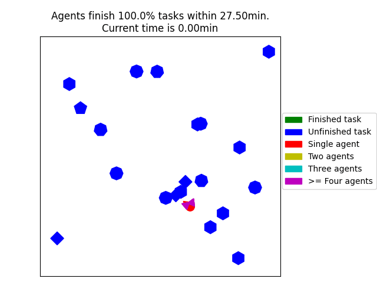

# DCMRTA

Code for ICRA 2024 Paper: **Dynamic Coalition Formation and Routing for Multirobot Task Allocation via Reinforcement Learning**.

This repository uses deep reinforcement learning to address single-task agent (ST) multi-robot task (MR) assignment.
Agents are trained to make decisions sequentially and execute task allocation in a decentralized manner.

## Demo



## Code Structure

```
DCMRTA/
├── dcmrta/                  # Core Python package
│   ├── attention.py         # Attention-based neural network (Transformer)
│   ├── environment.py       # MRTA task environment
│   ├── worker.py            # Episode runner (training/evaluation)
│   ├── runner.py            # Ray distributed runner
│   ├── training.py          # Distributed REINFORCE training loop
│   └── config.py            # Hyperparameters and paths
├── scripts/                 # Executable scripts
│   ├── train.py             # Training entry point
│   ├── test.py              # Evaluate trained model
│   ├── generate_testset.py  # Generate test environments
│   └── plot_results.py      # Plot comparison results
├── baselines/               # Baseline solvers
│   ├── ctas_d.py            # CTAS-D solver wrapper
│   ├── or_tools.py          # OR-Tools VRP solver wrapper
│   ├── ctas_d_test.sh       # Run CTAS-D on test set
│   └── CTAS-D/              # C++ CTAS-D implementation
├── data/                    # Test datasets
├── checkpoints/             # Model checkpoints (gitignored)
├── assets/                  # Static assets (images, GIFs)
└── tests/                   # Unit tests
```

Three main components:
1. **Environments** — randomly generate task locations/requirements and agent depots
2. **Neural network** — attention-based policy network in PyTorch
3. **Ray framework** — distributed REINFORCE implementation via Ray

## Quick Start

### Requirements

- Python >= 3.8
- torch >= 1.8.1
- numpy, ray, matplotlib, scipy, pandas, ortools, pyyaml, natsort

```bash
pip install -r requirements.txt
```

### Training

1. Edit hyperparameters in `dcmrta/config.py`
2. Run:
   ```bash
   python scripts/train.py
   ```

### Evaluation

1. Generate a test set:
   ```bash
   python scripts/generate_testset.py
   ```

2. Run baselines:
   - **OR-Tools:**
     ```bash
     python baselines/or_tools.py
     ```
   - **CTAS-D** (requires C++ build):
     ```bash
     cd baselines/CTAS-D
     mkdir build && cd build
     cmake .. && make
     cd ../../..
     bash baselines/ctas_d_test.sh
     ```
   - **REINFORCE (trained model):**
     ```bash
     python scripts/test.py
     ```

3. Plot results:
   ```bash
   python scripts/plot_results.py
   ```

## License

MIT License — see [LICENSE](LICENSE) for details.

## Citation

If you use this code in your research, please cite our ICRA 2024 paper.
